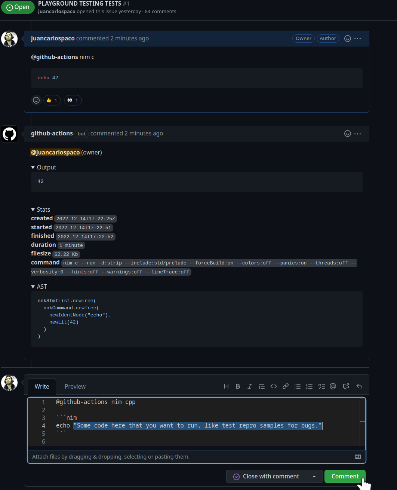

# Nimrun-Action

- [GitHub Action](https://github.com/features/actions) to compile and run Nim source code from GitHub issue comments code blocks.




# Use

```yaml
on:
  issue_comment:
    types: created
jobs:
  build:
    runs-on: ubuntu-latest
    steps:
      - uses: actions/checkout@master
      - uses: jiro4989/setup-nim-action@v1
        with:
          nim-version: 'devel'
      - uses: juancarlospaco/nimrun-action@main
        with:
          github-token: ${{ secrets.GITHUB_TOKEN }}
```

- Nim version to use depends on `nim-version` of `jiro4989/setup-nim-action`.
- `@github-actions` adds :eyes: Reaction to your Github issue comment when seen.
- `@github-actions` adds :+1: Reaction to your Github issue comment when your code compiles and runs OK.
- `@github-actions` adds :-1: Reaction to your Github issue comment when your code fails to run.
- `@github-actions` adds 1 new Github issue comment with the results and stats about your code.

The Bot will match Github issue comments that starts with:

- `"@github-actions nim c"`
- `"@github-actions nim cpp"`
- `"@github-actions nim js"`
- `"@github-actions nim e"`

And followed by a code block of Nim source code.


# Security

- Only users with write permissions can run code (Admins and Collaborators with Push permissions).


# Requisites

- `jiro4989/setup-nim-action` to setup Nim.


# FAQ

- Why not take care of setting up Nim by itself?.

Because some people already do it with just Git or Gitnim or Choosenim or setup-nim-action.
